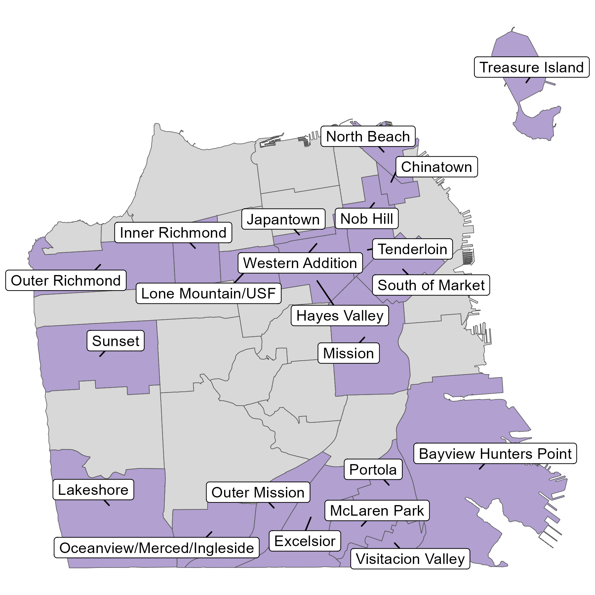

# FY 2023 ACS 5-Year 2011-2015 Low- and Moderate-Income Summary Data

This repo contains the data and code behind [OEWD's Low-to Moderate Income Neighborhoods.](https://sfgov.maps.arcgis.com/apps/webappviewer/index.html?id=02dfc61fc8a44e5c878cef9a5a2b3c86)

